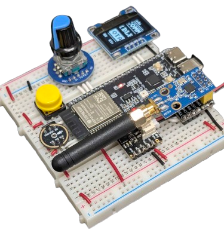
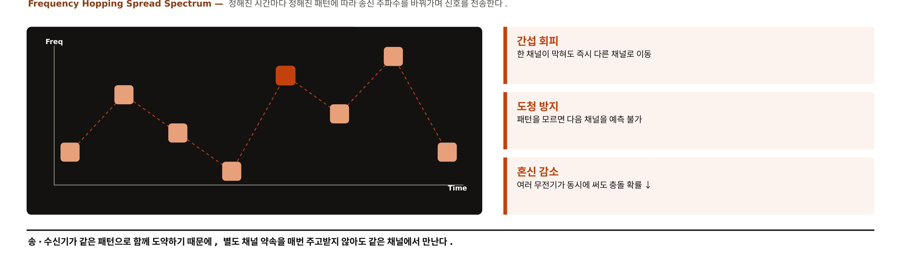
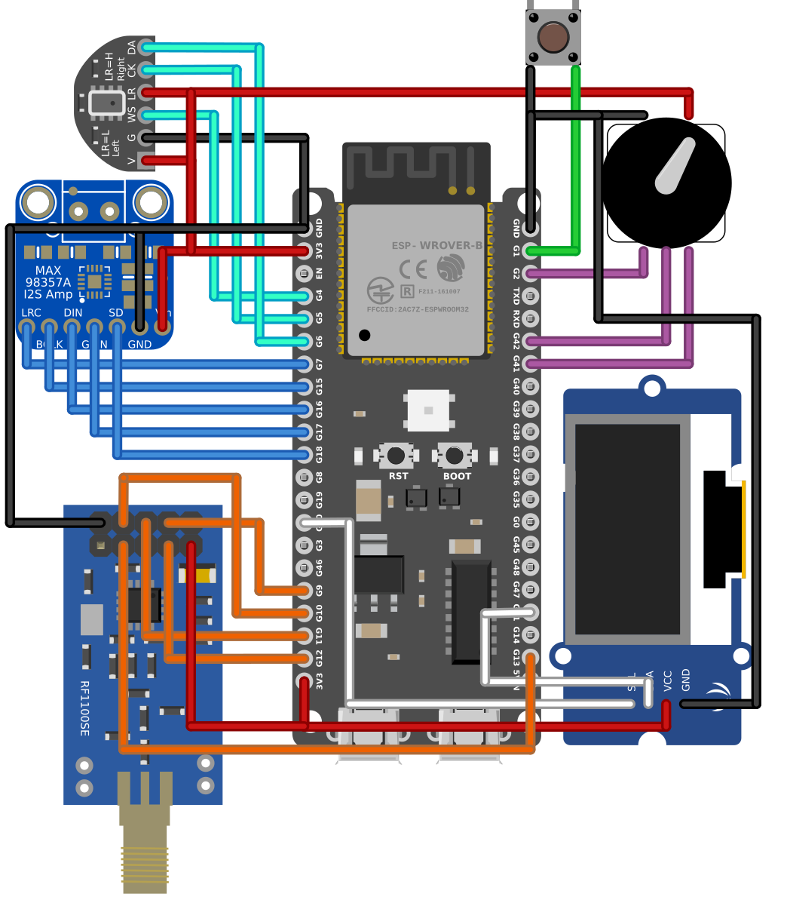
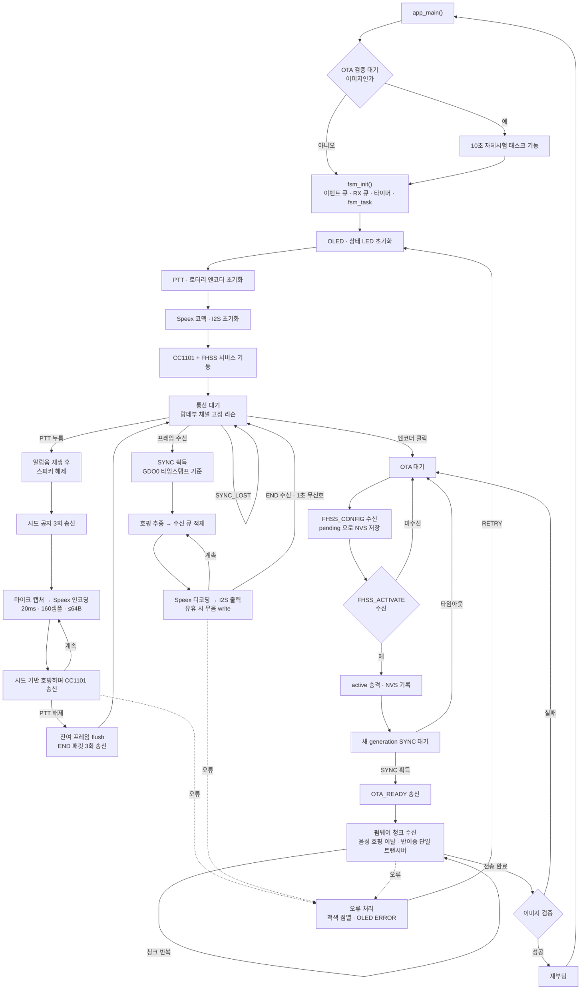
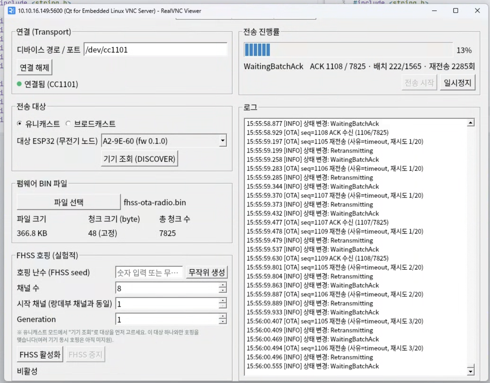
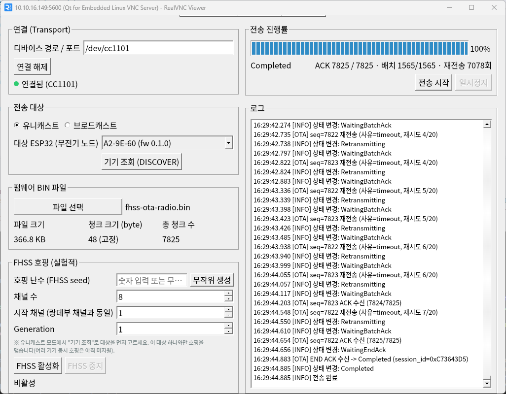
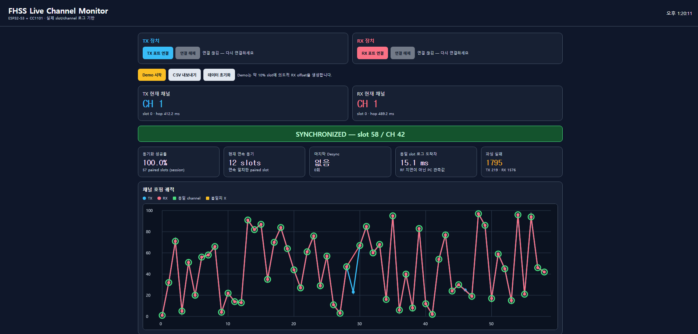
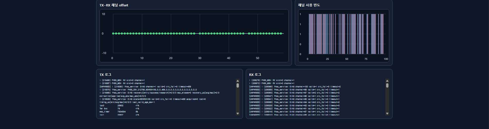

# FHSS OTA Radio

<p align="center">
  
  <br>
  <sub>무전기 단말 프로토타입 — ESP32-S3 + CC1101 + OLED + 마이크/스피커 + PTT 버튼 + 로터리 엔코더</sub>
</p>

주파수 호핑(FHSS)으로 음성 통신을 하고, **같은 무선 모듈 하나로** 펌웨어 무선 업데이트(OTA)까지 처리하는 무전기 시스템. Wi-Fi나 인터넷 없이 Sub-GHz RF 링크만 사용한다.

단말 펌웨어, 게이트웨이(커널 드라이버 + Qt 앱), 공용 패킷 규격, Yocto 이미지 레시피가 각각 별도 레포로 나뉘어 있다. 이 문서는 전체를 묶는 개요이고, 구현 세부와 트러블슈팅은 각 레포 README에 있다.

## 무엇을 만들려고 했나

인터넷도, 기지국도, 사전에 깔아둔 인프라도 없는 현장에서 **음성으로 통신하면서, 그 통신을 위해 이미 깔려 있는 RF 링크만으로 단말 펌웨어까지 갱신하는 것**이 목표다. 네 가지 요구가 여기서 나온다.

- **주파수 호핑 음성 통신** — 단말끼리 미리 정한 규칙으로 계산한 채널 순서를 따라 짧은 간격마다 옮겨 다니며 통신한다. 한 주파수에 머무르지 않으므로 특정 채널의 간섭·재밍·수동 도청에 상대적으로 강하다.
- **RF 경유 펌웨어 업데이트** — 단말을 회수해서 USB로 굽거나, Wi-Fi를 새로 붙이지 않는다. 게이트웨이가 펌웨어 이미지를 잘게 쪼개 무선으로 보내고, 단말은 검증한 뒤 파티션을 전환해 새 펌웨어로 재부팅한다.
- **하나의 무선 모듈 공유** — 음성용과 OTA용 트랜시버를 따로 두지 않는다. 반이중이라 두 기능을 동시에는 할 수 없어서, 단말 상태 머신이 라디오의 소유권과 모드 전환을 직렬화한다. 부품 수와 단가를 줄이는 대신 설계 난이도를 떠안는 선택이다.
- **대상 단말 지정 배포** — 게이트웨이가 대기 중인 단말을 조회해 대상을 고르고, 그 기기 하나에 펌웨어를 보낸다. 여러 단말에 한 번에 뿌리는 브로드캐스트는 다음 단계다.

## 시스템 구성

```text
[ESP32-S3 단말 A] <---- FHSS 음성 (Sub-GHz, OTA와 같은 라디오) ----> [ESP32-S3 단말 B]
        ^
        |  공통 채널에서 동기 획득 -> 같은 순서로 호핑
        |
[Raspberry Pi 4B — OTA 게이트웨이]
   ├─ kernel-cc1101-spi   커널 드라이버: 무선 모듈 제어, 채널 전환·동기 신호 송신
   ├─ gateway-ota         Qt 앱: 펌웨어 분할 -> 전송 -> 응답 확인 -> 재전송
   └─ meta-walkie-talkie  Yocto 이미지(커널 모듈 + 앱을 굽는 빌드 레시피)
                 ↑
          ota-protocol    단말과 게이트웨이가 같이 쓰는 패킷 규격
```

단말은 **ESP32-S3 + ESP-IDF/FreeRTOS**, 게이트웨이는 **Yocto로 직접 구운 리눅스 + Qt 앱**이다. 무선 모듈 제어는 단말에서는 펌웨어가, 게이트웨이에서는 리눅스 커널 모듈이 맡는다. 양쪽이 같은 규격으로 대화해야 하므로 패킷 정의는 별도 레포에 두고 공유한다.

## FHSS: 계속 채널을 바꾸며 통신하기

한 주파수에 머무르지 않고, 정해진 시간마다 정해진 패턴에 따라 송신 채널을 바꿔가며 신호를 전송한다. 송신기와 수신기가 같은 패턴으로 함께 도약하기 때문에, 매번 채널을 따로 약속하지 않아도 같은 채널에서 만난다.

<p align="center">
  
  <br>
  <sub>정해진 패턴을 따라 채널을 옮겨 다니며 통신한다 — 간섭 회피 · 도청 방지 · 혼신 감소</sub>
</p>

채널을 계속 바꾸는 덕분에 세 가지 이점이 생긴다.

- **간섭 회피** — 한 채널이 막혀도 금방 다른 채널로 옮겨가 통신을 이어간다.
- **도청 방지** — 도약 패턴을 모르면 다음 채널을 예측할 수 없다.
- **혼신 감소** — 여러 무전기가 동시에 써도 같은 채널에서 부딪칠 확률이 낮아진다.

이 프로젝트에서는 두 단말이 seed값을 기반으로 같은 순서로 도약하도록, 미리 공유한 비밀값과 세션마다 새로 정하는 값을 합쳐 채널 순서를 만든다. 서로 다른 비밀값을 가진 단말끼리는 아예 다른 순서가 나오므로 동기와 도청 저항을 동시에 얻는다. 시드 파생·동기·복구 알고리즘의 자세한 내용은 [`ota-protocol`](https://github.com/fhss-ota-radio/ota-protocol/tree/feature/fhss-sync-public-seed)과 [`firmware-esp32`](https://github.com/fhss-ota-radio/firmware-esp32/tree/develop)에 있다.

## 레포 구성

| 레포 | 역할 | 기준 브랜치 |
|---|---|---|
| [`firmware-esp32`](https://github.com/fhss-ota-radio/firmware-esp32/tree/develop) | 무전기 단말 펌웨어 — 음성 입출력·화면·호핑·OTA 수신 | `develop` |
| [`gateway-ota`](https://github.com/fhss-ota-radio/gateway-ota/tree/refactor/dedupe-fixed-channel-reset) | OTA 매니저 Qt 앱 — 펌웨어 분할·전송·재전송·기기 조회 | `refactor/dedupe-fixed-channel-reset` |
| [`kernel-cc1101-spi`](https://github.com/fhss-ota-radio/kernel-cc1101-spi/tree/develop) | 라즈베리파이용 무선 모듈 커널 드라이버 | `develop` |
| [`ota-protocol`](https://github.com/fhss-ota-radio/ota-protocol/tree/feature/fhss-sync-public-seed) | 단말·게이트웨이 공용 패킷 규격 | `feature/fhss-sync-public-seed` |
| [`meta-walkie-talkie`](https://github.com/fhss-ota-radio/meta-walkie-talkie/tree/feature/cc1101_v1) | 게이트웨이 리눅스 이미지 Yocto 레이어 | `feature/cc1101_v1` |
| [`docs-architecture`](https://github.com/fhss-ota-radio/docs-architecture) | 프로젝트 명세, 동기화 설계, 개발 컨벤션 | `main` |

> 레포마다 `main`이 초기 상태로 남아 있는 곳이 있어, 최신 코드는 "기준 브랜치" 열을 따른다.

## 하드웨어

<p align="center">
  
  <br>
  <sub>단말 프로토타입 배선도 (Fritzing, 커스텀 파트 제작 — 모듈 그래픽은 핀 배열이 같은 대체 부품 사용)</sub>
</p>

- **단말** — ESP32-S3-DevKitC-1, CC1101 무선 모듈(433MHz), I2S 마이크·앰프, OLED, PTT 버튼, 로터리 엔코더
- **게이트웨이** — Raspberry Pi 4B에 같은 CC1101 모듈을 물려 SPI로 제어

핀맵은 브레드보드 실측 과정에서 몇 차례 바뀌었다. 최신 값과 그렇게 정한 이유는 [`firmware-esp32`](https://github.com/fhss-ota-radio/firmware-esp32/tree/develop)에 정리돼 있다.

## 단말 동작 흐름

부팅부터 음성 송수신, OTA, 오류 복구까지 단말 상태 머신이 도는 전체 경로.



음성과 OTA가 같은 라디오를 쓰기 때문에 두 경로는 상태 머신에서 갈라진다. OTA에 들어가면 음성 호핑에서 이탈했다가, 끝나면 다시 대기 상태로 돌아온다.

## OTA 게이트웨이

라즈베리파이에서 도는 Qt 앱. 연결, 대상 기기 조회, 펌웨어 파일 선택, 호핑 설정, 진행률과 로그가 한 화면에 있다. 무선 구간에서는 패킷이 빠질 수 있으므로, 보낸 조각마다 응답을 확인하고 빠진 것만 골라 다시 보낸다.

<p align="center">
  
  
  <br>
  <sub>왼쪽: 전송 진행 중(응답 대기·재전송 로그) · 오른쪽: 전량 전송 완료</sub>
</p>

## 진행 상황

단말 간 FHSS 음성 통신, 게이트웨이에서 단말로의 펌웨어 전송, 그리고 호핑 중인 상태에서의 펌웨어 전송까지 실기기로 확인했다. 전송받은 펌웨어는 무결성 검증을 통과한 뒤 실제로 부팅되는 것까지 확인된다.

TX·RX serial 로그를 실시간으로 파싱하는 웹 모니터로 두 단말이 같은 slot에서 같은 채널로 이동하는지 눈으로 확인할 수 있다. 아래는 데모 실행 화면으로, 동기 성공률 100%와 연속 12 slot 일치, TX–RX 채널 offset 0 유지를 보여준다.

<p align="center">
  
  <br>
  <sub>실시간 채널 모니터 — SYNCHRONIZED(slot 58 / CH 42), 아래 그래프는 TX·RX 채널 호핑 궤적이 일치하는 모습</sub>
</p>

<p align="center">
  
  <br>
  <sub>TX–RX 채널 offset 0 유지 · 채널 사용 빈도 분포 · TX/RX 실시간 로그</sub>
</p>

단계별 검증 내역과 남은 과제는 각 레포 README와 [`docs-architecture`](https://github.com/fhss-ota-radio/docs-architecture)에 정리돼 있다.

## 팀

5인. PM/오디오·화면 · OTA/부트로더 · 리눅스 커널 드라이버 · Qt 앱 · FHSS 알고리즘.

역할별 상세와 개발 규칙(Git Flow, 브랜치·커밋 컨벤션)은 [`docs-architecture`](https://github.com/fhss-ota-radio/docs-architecture) 참고.
